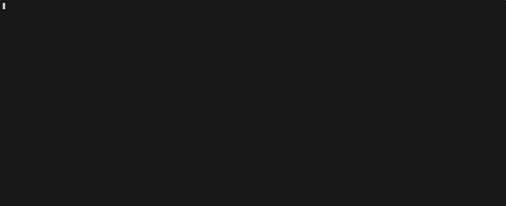

# День 02 — Управление параметрами запроса



Расширение программы дня 01. Добавлены флаги для управления поведением модели: роль, формат ответа, лимит токенов и условие остановки.

## Флаги

| Флаг | API параметр | Описание |
|---|---|---|
| `-message` | `messages[0].content` | Сообщение пользователя (обязательный) |
| `-system` | `system` | Роль и инструкции для модели |
| `-output_schema` | `output_config.format` | JSON Schema для структурированного ответа |
| `-max_tokens` | `max_tokens` | Максимум токенов в ответе (по умолчанию: 1024) |
| `-stop_sequences` | `stop_sequences` | Строка, при появлении которой генерация останавливается |
| `-verbose` | — | Вывести сырой JSON-ответ от API |

## Примеры

Простой запрос с ролью:

```bash
./day02 -message "Объясни горутины" -system "Ты эксперт по Go"
```

Структурированный ответ по JSON Schema:

```bash
./day02 \
  -message "2+2" \
  -system "Ты математик" \
  -max_tokens 100 \
  -output_schema '{"type":"object","properties":{"result":{"type":"integer"}},"required":["result"],"additionalProperties":false}'
```

> JSON Schema требует `"additionalProperties": false` для каждого объекта.

Остановка генерации по строке:

```bash
./day02 -message "Перечисли языки программирования" -stop_sequences "4."
```

Сырой ответ API:

```bash
./day02 -message "Привет" -verbose
```

## Переменные окружения

| Переменная | Описание |
|---|---|
| `ANTHROPIC_API_KEY` | API-ключ (обязательный) |
| `ANTHROPIC_GATEWAY_URL` | URL шлюза (по умолчанию: `https://api.anthropic.com`) |
